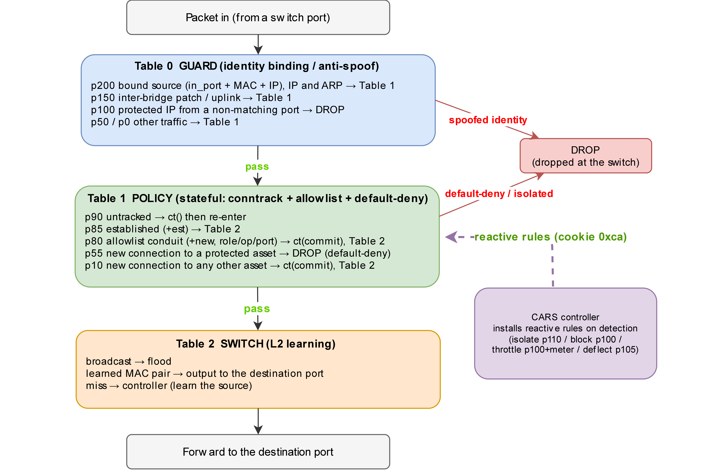
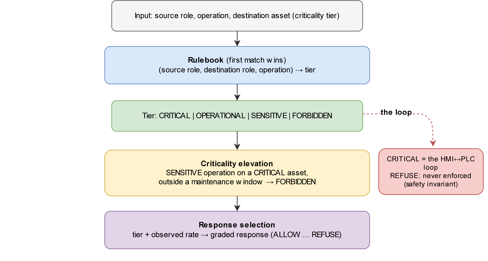
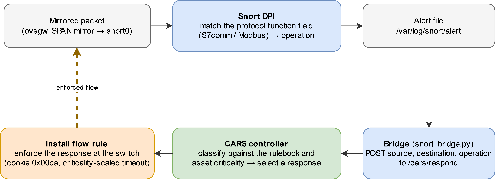

# CARS architecture

CARS is a reactive intrusion-response system for industrial control networks. It decides on two axes a uniform block ignores — the **criticality** of the asset under attack and the **industrial operation** recovered from the packet — and enforces a **bounded, reversible, evidence-generating** response as OpenFlow rules. This page maps the design onto the code; the full treatment is the dissertation's Chapter 3.

## Where CARS sits

All traffic to a protected asset crosses the software-defined fabric, which the CARS controller governs. Detection is out-of-band (a Snort mirror); the controller makes the graded decision and enforces it in the data plane.


Three OpenFlow switches sit under one controller: two process cells (`ovs1`, `ovs2`) and a gateway (`ovsgw`). The controller runs on an out-of-band management plane. Assets carry a functional role and a criticality tier.

## The enforcement pipeline

Every packet meets the same three-table pipeline on each switch:



- **Table 0 — GUARD (stateless identity binding).** Binds each protected IP to its port and MAC; a spoofed identity is dropped before it reaches policy.
- **Table 1 — POLICY (stateful).** Kernel connection-tracking passes an established flow, then an allowlisted conduit, then any reactive rule the controller has installed (cookie `0x00ca`, priority 110), and default-denies everything else (`0x00a2`).
- **Table 2 — SWITCH.** L2 learning forwards what survives; a miss is a Packet-In to the controller.

## The decision

When the sensor recovers an operation, the controller classifies it and selects a graded response:



- `classify(src, dst, op)` resolves the source and destination **roles** and takes the **first matching** rulebook row to a tier (`OPERATIONAL`, `SENSITIVE`, `FORBIDDEN`; the HMI–PLC safety loop is `CRITICAL` and never enforced against).
- **Criticality elevation:** a `SENSITIVE` operation on a `CRITICAL` asset, outside a maintenance window, is elevated to `FORBIDDEN`.
- `select_response()` picks a rung of the ladder (ALLOW, MONITOR, THROTTLE, DEFLECT, ISOLATE, BLOCK, REFUSE); the block/isolate hold is criticality-scaled to `30 + 15w` seconds (75/60/45/30 for CRITICAL/HIGH/MEDIUM/LOW) and self-expires.

## Detection to response



A mirrored packet is inspected by Snort, whose alert the bridge turns into an operation and a rate and posts to `/cars/respond`; the controller decides and installs the enforcing flow, which self-heals on timeout.

## Component map (code)

| Component | Role | Source |
|---|---|---|
| Decision engine + southbound + API | `classify`, criticality elevation, `select_response`, GUARD, the three-table install, the control API | `06_Build/cars_engine.py` |
| Detection adapter | Snort alert file → operation/rate → `POST /cars/respond` | `06_Build/snort_bridge.py` |
| Flow-integrity checker | polls / event-monitors the tables against a trusted baseline (cookie `0x00a2`) | `06_Build/cars_flow_audit.py` |
| Remediation agent | last-good restore of the process value | `06_Build/cars_remediation.py` |
| Site config | policy (assets, roles, conduits, rulebook, criticality) in `site.yaml` | `framework/cars/config/` |
| Emulation | software S7/Modbus PLCs + Mininet fabric, no hardware | `framework/emulation/` |

## Configuration model

The engine's policy is externalised: point it at a config and it overlays assets, roles, conduits, rulebook, criticality, timeouts and GUARD bindings from `site.yaml`; unset, it uses its built-in defaults unchanged.

```bash
CARS_SITE=examples/site.testbed.yaml  osken-manager 06_Build/cars_engine.py
```

`framework/tests/test_config_parity.py` proves the shipped `site.testbed.yaml` reproduces the built-in policy exactly, so config mode is byte-equivalent to the validated defaults.
